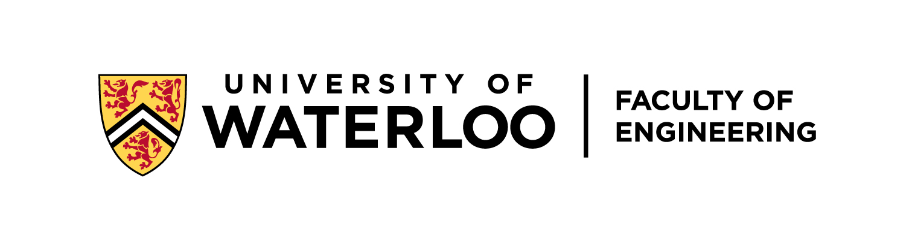
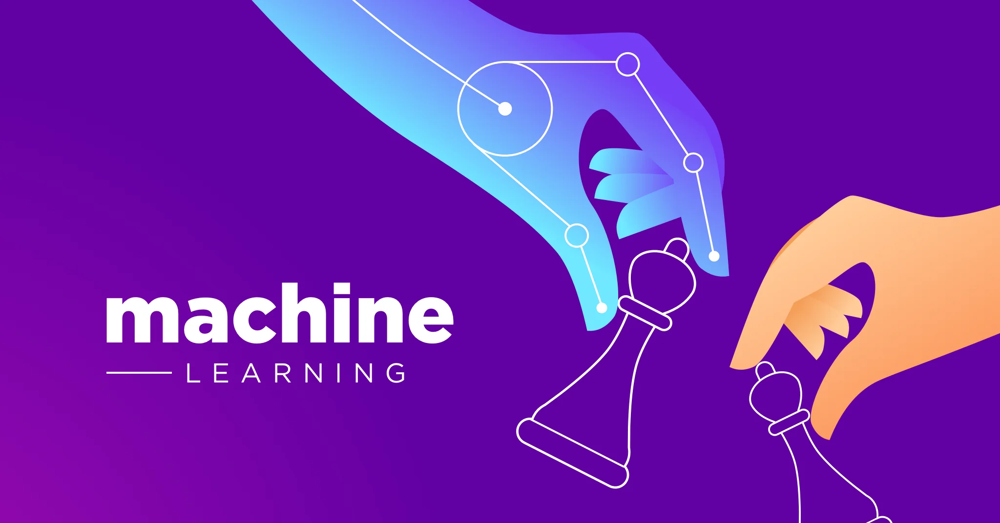

 

# ECE 457B - Fundamentals of Computational Intelligence

 
Welcome to ECE 457B, offered by the University of Waterloo. This course dives into advanced topics of control systems with a focus on machine learning applications.

## Course Logistics

- **Term:** Winter 2024
- **Format:** In-person
- **Location:** E7-5353

### Schedule

- **Tuesdays:** 10:00 AM - 11:30 AM
- **Wednesdays:** 1:00 PM - 2:30 PM

### Instructor

**Amir-Hossein Karimi**
- **Office:** EIT-3108
- **Website:** [amirkarimi.com](http://amirkarimi.com/)
- **Email:** [amirh.karimi@uwaterloo.ca](mailto:amirh.karimi@uwaterloo.ca)

### Teaching Assistants

- **Head TA:** Fatemeh Tavakoli; [Email](mailto:email-address)
- **TA1:** Keith Rebelo; [Email](mailto:email-address)
- **TA2:** Kaixiang Zheng; [Email](mailto:email-address)

### Office Hours

- **Time:** TBD
- **Location:** TBD

## Course Timetable

*Please note that the timetable below is a concise version. The full timetable is available in the repository.*

| Week | Date  | Topics                                             | Tutorials         | Deliverables             |
|------|-------|----------------------------------------------------|-------------------|--------------------------|
| 1    | Jan 8 | Introduction to Machine Learning Concepts          | Python Review     | Assignment 1             |
| ...  | ...   | ...                                                | ...               | ...                      |
| 7    | Feb 19| Reading Week                                       | -                 | Midterm Exam             |
| ...  | ...   | ...                                                | ...               | ...                      |
| 12   | Apr 1 | Advanced Topics and Future Directions              | Exam Review       | -                        |
| 13   | Apr 27| Final Examination Week                             | -                 | Final Exam               |

## Course Objectives

Upon completing this course, students will be able to:

- Formulate and solve advanced control system problems using machine learning.
- Select appropriate algorithms for different types of machine learning tasks.
- Implement key machine learning algorithms from scratch.
- Apply these algorithms to analyze real-world datasets.

## Resources

- [Lecture Slides](link-to-slides)
- [Assignments](link-to-assignments)
- [Project Guidelines](link-to-project-guidelines)
- [Examination Resources](link-to-exam-resources)
- [Reading List](link-to-reading-list)

## Piazza

- **Discussion Forum:** TBD

## Contributing

Contributions to the course material are welcome. Please adhere to the [contribution guidelines](link-to-guidelines) if you wish to contribute.

## License

This project is licensed under the MIT License - see the [LICENSE](LICENSE) file for details.

## Acknowledgments

Special thanks to the teaching staff, students, and everyone who contributed to the development and continuous improvement of this course.

For further information or questions, please contact the course instructor at [instructor-email](mailto:instructor-email).

